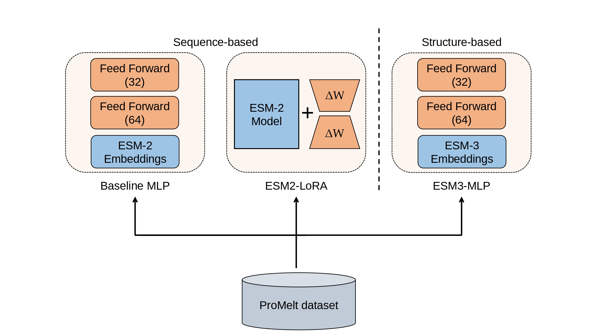

<p align="center">
  
</p>

# TmProt Predictor

Protein melting temperature (Tm) prediction using protein language models. Given a protein sequence (and 3D structures for the third strategy), the models predict how thermally stable it is.

Three prediction strategies are available:

| Strategy | Model | Notes |
|----------|-------|-------|
| **Baseline MLP** | ESM2 (650M) + MLP | Fastest to run |
| **ESM2-LoRA** | ESM2 fine-tuned with LoRA | Best sequence-only accuracy |
| **ESM3-MLP** | ESM3 (98B) + MLP | Requires free API token and 3D protein structures (PDB) |

## Workflow

<p align="center">
  
</p>

**Figure 1: TmProt development workflow.** The training dataset, ProMelt (comprising 45,441 proteins), was assembled by merging and length-filtering two proteomics-based sources: Meltome Atlas (n=41,916) and ProThermDB (n=3,525). The resulting dataset was split at 25% maximum sequence identity into training, validation, and test subsets. Three modeling strategies of increasing complexity were evaluated:
- **Baseline MLP** uses frozen ESM-2 embeddings as input features to an MLP regressor with two hidden layers of 64 and 32 neurons, respectively
- **ESM2-LoRA** applies Low-Rank Adaptation (LoRA) fine-tuning directly to ESM-2 transformer blocks for end-to-end thermostability regression, where ΔW denotes the trainable low-rank weight updates while the original ESM-2 weights remain frozen
- **ESM3-MLP** generates structural embeddings from ESM-3 using protein structures retrieved from AlphaFoldDB as input to an MLP regressor with the same architecture as Baseline MLP

The currently deployed version of TmProt 1.0 is based on the ESM2-LoRA strategy.

---

## Web Server

The **TmProt web server** is available at: **https://loschmidt.chemi.muni.cz/tmprot**

Use the web interface for quick predictions without setting up the local environment.

---

## Getting Started

### Step 0 — Quick Prediction with TmProt 1.0 CLI

The production ESM2-LoRA model (TmProt 1.0) is bundled as a standalone CLI tool. **If you only want to predict thermostability, install this and skip Steps 1 and beyond.** If you want to run the full training and evaluation pipeline on your own data or reproduce our results, start with Step 1.

```bash
cd tmprot-1.0
pip install -e .
```

Predict thermostability for a FASTA file:

```bash
tmprot --input proteins.fasta --outdir predictions/ --threshold 60.0
```

**Arguments:**
- `--input, -i` — FASTA file with protein sequences (required)
- `--outdir, -o` — Output directory for CSV results (optional)
- `--threshold, -t` — Thermostability threshold in °C (default: 60.0)
- `--delimiter, -d` — CSV delimiter (default: tab)

**Example output (`predictions/proteins.csv`):**
```
Rank  ID        Predicted Tm [°C]  Thermostable
1     protein_A  65.5              Yes
2     protein_B  54.2              No
```

For more details, see the [tmprot-1.0 package README](tmprot-1.0/README.md).

> **Don't want to set up anything?** Use the [web server](https://loschmidt.chemi.muni.cz/tmprot) instead.

---

## Full Pipeline — Training and Evaluation from Scratch

Follow the steps below to reproduce the full TmProt training pipeline or train your own models.

### 1. Clone and set up environment

**Option A: Conda (recommended for development)**

```bash
git clone git@github.com:loschmidt/TmProt.git
cd TmProt

conda env create -f environment.yaml
conda activate tmprot
```

**Option B: Pip**

```bash
git clone git@github.com:loschmidt/TmProt.git
cd TmProt

python -m venv venv
source venv/bin/activate

pip install -e .
```

### 2. Download the data

Data is hosted on Zenodo. Run the setup script to download it:

```bash
# Download everything (recommended for first run)
python scripts/setup_data.py

# Or download only specific datasets
python scripts/setup_data.py --datasets brenda fireprot ered_wt ered_asr cas hld
```

Data will be placed in `data/` automatically.

> **Zenodo record:** https://zenodo.org/records/20067528

### 3. Configure API keys (`.env`)

Copy the example file:

```bash
cp .env.example .env
```

- **Running Baseline MLP or ESM2-LoRA?** No changes needed — leave `.env` as is.
- **Running ESM3-MLP?** Add your ESM3 API token (free, see [ESM3 Setup](#esm3-mlp-setup) below).
- **Want experiment tracking?** Fill in the DagsHub credentials for MLflow logging.

---

## Running the Models

### Run all three strategies

```bash
python src/scripts/run_strategies.py --strategies all
```

### Run a single strategy

```bash
# Baseline MLP — ESM2 embeddings + sklearn MLP
python src/scripts/run_strategies.py --strategies baseline_mlp

# ESM2-LoRA — fine-tuned ESM2 with LoRA adapters
python src/scripts/run_strategies.py --strategies esm2_lora

# ESM3-MLP — ESM3 embeddings + sklearn MLP (requires API token, see below)
python src/scripts/run_strategies.py --strategies esm3_mlp
```

Results are saved to `models/{strategy_name}/` — one CSV and JSON per evaluation dataset.

### Optional: Enable MLflow experiment tracking

```bash
python src/scripts/run_strategies.py --strategies all --mlflow
# Requires DagsHub credentials in .env
```

---

## ESM3-MLP Setup

ESM3-MLP needs a free API token from EvolutionaryScale to generate protein embeddings.

**1. Get a token** — visit https://forge.evolutionaryscale.ai/apikeys, sign up, and copy your token.

**2. Add it to `.env`:**

```bash
ESM3_API_TOKEN=your_token_here
```

**3. Run** — embeddings are generated automatically on first run:

```bash
python src/scripts/run_strategies.py --strategies esm3_mlp
```

**Required: Provide PDB structures**

To run the ESM3-MLP strategy, 3D protein structure files are required. Use the included download script to fetch AlphaFold2 structures for all UniProt IDs in the dataset:

```bash
# Download all available PDB structures
python scripts/download_pdb_structures.py

# See how many would be downloaded first
python scripts/download_pdb_structures.py --dry-run

# Resume after interruption (skips already-downloaded files)
python scripts/download_pdb_structures.py --resume
```

PDB files are placed in `data/pdb_structures/{ProteinID}.pdb` automatically. The pipeline then uses them to generate structural embeddings with ESM-3.

> **Note:** Only datasets with UniProt IDs (ProMelt, BRENDA, FireProt) can be auto-downloaded. Custom-ID datasets (CAS, ERED, HLD) fall back to sequence-only mode. For UniProt IDs missing from AlphaFold DB, we recommend [**OmegaFold**](https://github.com/HeliXonProtein/OmegaFold) to generate the missing structures — it runs locally on GPU without a database dependency and was used in the original TmProt study to cover proteins not found in AlphaFold DB.

---

## Visualizing Results

After running one or more strategies, generate comparison plots:

```bash
python src/eval/ranking.py
```

Saves ROC curves, enrichment plots, and scatter plots to `images/`.

---

## Project Structure

```
tmprot-1.0/                # Standalone CLI package (pip install -e .)
  src/tmprot/
    cli.py                 # tmprot command entry point
    helpers.py             # Model loading (ESM2-LoRA)
    model/                 # Pre-trained LoRA adapter

scripts/
  setup_data.py              # Download datasets from Zenodo
  download_pdb_structures.py # Download AlphaFold2 PDB files for ESM3-MLP

src/
  strategies/     # Three prediction strategies (baseline_mlp, esm2_lora, esm3_mlp)
  scripts/        # Entry points: run_strategies.py, extract_esm2_embeddings.py
  eval/           # Metrics, plotting, ranking
  data/           # Data loading and tokenization
  models/         # LoRA model loading
  training/       # ESM2-LoRA trainer

data/
  promelt/        # ProMelt training and test sets
  evaluation_sets/  # 6 independent evaluation datasets
  pdb_structures/ # PDB files for ESM3-MLP (auto-downloaded)

models/           # Output: saved models, predictions, metrics
images/           # Output: scatter plots, ROC curves, enrichment plots
```

## Advanced

- `--run_name NAME` — save outputs to a custom directory: `models/{NAME}/`
- `--mlflow` — log params, metrics, and model artifacts to DagsHub

## Citation

If you use TmProt in your research, please cite:

[**Investigation of Protein Melting Temperature Prediction with Cross-Method Validation on Biophysical Data**](https://doi.org/10.64898/2026.05.07.723192)
